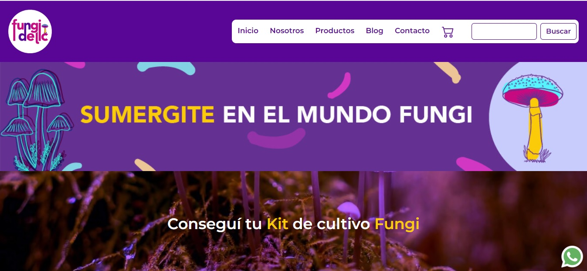
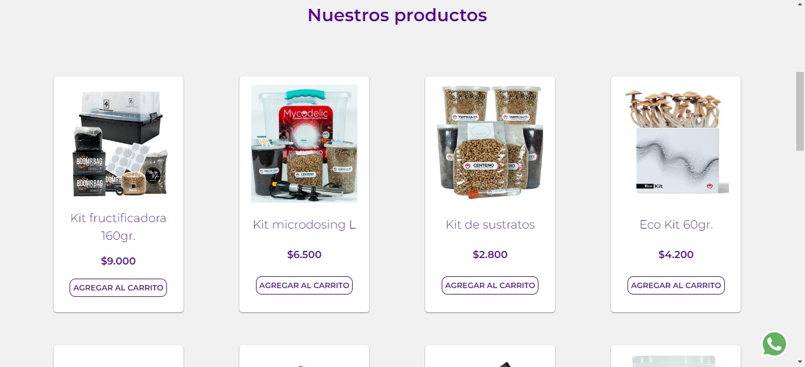
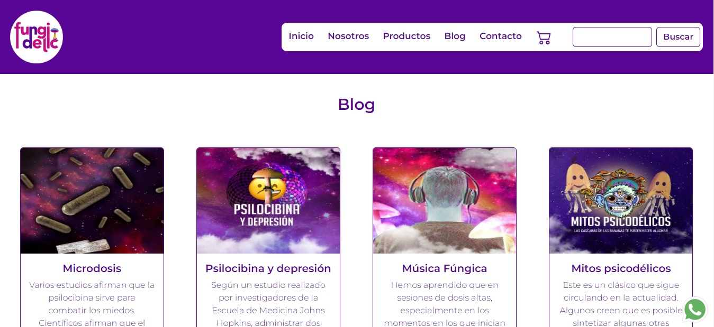

<h1>Fungidelic</h1>

Fungidelic es una página de venta de productos de autocultivo de hongos desarollada con HTML5 y CSS3 como proyecto final del Curso de Desarrollo Web dictado por Coderhouse.

<h2>Screenshots</h2>

<h2>Estructura</h2>
<ol>
<li>Index: Incluye categorías de productos, banners publicitarios, ofertas y videos instructivos de autocultivo de hongos.</li>

<li>Nosotros: Página que contiene información sobre la empresa y detalla los productos y servicios que se brindan.</li>

<li>Productos: Listado de Cards de productos</li>

<li>Blog: Contiene artículos de interés y actualidad sobre el autocultivo de hongos.</li>

<li>Contacto: Página con mapa de ubicación de la tienda física, redes sociales y formulario de contacto.</li>
</ol>

<h2>Tecnologías utilizadas</h2>

<ol>
<li>Html 5</li>
<li>Css 3</li>
<li>Scss</li>
<li>Librerías: Bootstrap y Animate.css</li>
</ol>

<h2>Autora</h2>

Daniela Sinagra. 2022
